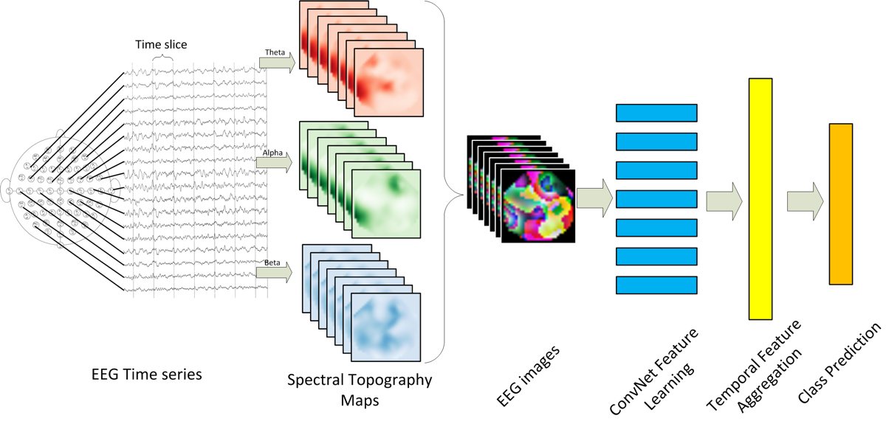

# EEGLearn_mytest
Try to show the pictures in EEGLearn, add model save and load to do prediction. I use Pytorch in this project.  
The original method is from https://github.com/VDelv/EEGLearn-Pytorch  
I just changed it a little bit, which may help you understand the method better.

##Method show

|:--:| 
| Taken from [Bashivan et al. 2016](https://arxiv.org/pdf/1511.06448.pdf)|

|:--:| 
| images in the dataset |

## References 

If you are using this code please [cite](Cite.bib) the paper:

Bashivan, et al. "Learning Representations from EEG with Deep Recurrent-Convolutional Neural Networks." International conference on learning representations (2016).

https://arxiv.org/pdf/1511.06448.pdf
